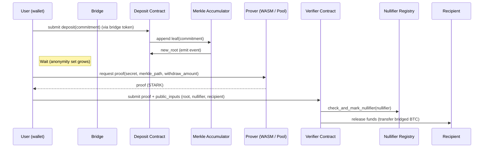

# Zephyr — ZK-Private Bitcoin on Starknet

> A privacy layer / mixer for bridged BTC on Starknet: non-custodial, STARK-based, composable.

> Zephyr is a non-custodial, STARK-proof based privacy layer for bridged Bitcoin on Starknet. It lets users shield bridged BTC into a privacy set (commitments in a Merkle accumulator), generate STARK proofs proving ownership/eligibility, and withdraw to arbitrary recipients without linking deposits to withdrawals. The design is composed of Cairo contracts, off-chain provers (WASM or prover pool), a Merkle alifier registry. 

---

# Table of contents

1. [Why Zephyr? (Motivation)](#why-zephyr)
2. [High level architecture & diagrams](#architecture)

   * ASCII & mermaid diagrams
3. [Core cryptography & data structures](#crypto)
4. [Smart contract modules (Cairo)](#contracts)
5. [Proof system & prover options](#prover)
6. [User flows (deposit → wait → withdraw)](#flows)
7. [Security analysis & known risks](#security)
8. [Developer & integration guide (SDK, WASM, indexer)](#dev-guide)
9. [Testing, deployment & gas notes](#testing-deploy)
10. [Roadmap, governance & tokenomics summary](#roadmap)
11. [Contributing, License, Contact](#contributing)

> This README is long-form and technical by design — it intentionally contains architecture diagrams, circuit snippets, Cairo pseudocode, and operational guidance so a developer team can pick up the repo and start building. Much of the content below is adapted frwhere indicated. 

---

<a name="why-zephyr"></a>

## 1) Why Zephyr? (Motivation)

* When BTC is bridged onto L2s like Starknet it becomes visible on that ledger — linkable and subject to chain analysis. Zephyr aims to restore privacy for bridged BTC by providing a shieln Starknet while remaining composable with DeFi and governance. 
* Goals:

  * ers keep control of secrets; contracts do not hold private keys. 
  * **Quantitatively private**: unonymity set, range proofs for amounts, timing/batching defenses. 
  * **Practical**: Cairo implementatiM or prover pool), reasonable gas targets and gas-optimizations. 

---

<a name="architecture"></a>

## 2) High level architecture & diagrams

Below are compact diagrams you can copy/paste into GitHub Markdown. Use the mermaid blocks for nicer rendering on GitHub.

### 2.1 High-level ASCII schematic

```
[ Bitcoin mainnet (UTXO) ]  <--bridge--  [ Bridged BTC token on Starknet ]
                                      |
                                      v
                    ┌────────────────────────────────────────┐
                    │                Zephyr                 │
                    │  ┌─────────┐  ┌──────────┐  ┌───────┐ │
                    │  │Deposit  │  │Merkle    │  │Verifier│ │
                    │  │Contract │  │Accumulator│  │Contract│ │
                    │  └──┬──────┘  └──┬───────┘  └──┬────┘ │
                    │     │             │             │     │
                    │  Off-chain Prover (WASM or pool)   │
                    │  Indexer / Relayer / Prover Pool   │
                    └────────────────────────────────────┘
                                      |
                                      v
                       [ Private L2 assets / DeFi / NFTs ]
```

(More detailed diagrams follow.)

### 2.2 Mermaid — component diagram

```mermaid
flowchart LR
  BTC[Bitcoin mainnet UTXOs]
  Bridge[Bridge / Wrapped BTC]
  subgraph Zephyr
    Deposit[Deposit Contract]
    Merkle[Merkle Accumulator]
    Verifier[STARK Verifier Contract]
    Null[Nullifier Registry]
    Fee[Fee Manager]
    Governance[Zephyr DAO]
  end
  Offchain[Prover (WASM / Prover Pool)\nIndexer / Relayer]
  DeFi[Private DeFi / NFTs / DAO Apps]

  BTC --> Bridge --> Deposit
  Deposit --> Merkle --> Verifier
  Offchain --> Verifier
  Verifier --> Null
  Verifier --> Fee
  Governance --> Fee
  Merkle --> Offchain
  Deposit --> Offchain
  Deposit --> DeFi
  Verifier --> DeFi
```

> This mermaid diagram maps the major contracts and off-chain components. The on-chain root + verifier are the narrow are verified on chain; sensitive secrets never leave the client. 

### 2.3 Sequence: Deposit → Withdraw (mermaid)



---

<a name="crypto"></a>

## 3) Core cryptography & data structures

(Condensed technical reference — copy/paste friendly)

### 3.1 Commitment & nullifier formulas

* Commitment (stored as leaf in Merkle tree):

```
C = H( H(secret, nullifier) || amount || timestamp || randomness )
```

* Nullifier (prevents double spend):

```
nullifier = H(secret, "ZEPHYR_NULLIFIER" || index)
```

These formulas  the project brief and used by the Cairo circuits and contracts. 

### 3.2 Merkle accumulator

* Sparse Merkle tree, **depth = 20** (capacity ≈ 1,048,576 leaves).
* Root is anchored on-membership proofs. Off-chain indexers help clients build proofs. 

### 3.3 ZK proof statement (informal)

Prover proves the existence of private inputs (secret, nullifier, amount, randomness, merklePath) such that:

1. Commitment `C` matches hash construction.
2. `C ∈ MerkleTree(root)` (via merkle path).
3. `nullifier` has not been spent.
4. `withdraw_amount :contentReference[oaicite:27]{index=27} - fee_rate)`.
5. required delay/timing constraints satisfied. 

### 3.4 Hash choices

* Use **Poseidon** or **Pedersen** variants (ZK-friendly): Poseidon is faster in circuits; Pedersen is usg where appropriate. See `contracts/crypto/*` in the repo plan. 

---

<a name="contracts"></a>

## 4) Smart contract modules (Cairo overview)

This project uses Cairo 2 style contracts. The brief provides skeletons and complete psowing modules — keep these files under `contracts/` in the repo. 

### 4.1 Module list (summaryt` — accepts bridged token deposits and records commitmen

* `Merkle Tree Contract` — sparse Merkle accumulato
* `ZK Verifier Contract` — verifies STARK proofs on-chain. 
* `Withdrawal Machecks, fee calculation, nullifier registration, funds transfe
* `Fee Manager` — fee calculation and distribution policy.  Contract` — Zephyr DAO primitives (proposals, votes, timelock). 

### 4.2 Example Cairo snippet (deposit/withdraw skeleton)

```cairo
// contracts/Mixer.cairo (simplified skeleton)
%lang starknet

@storage_var
func commitments_root() -> (root: felt) {}
@storage_var
func nullifier_spent(nullifier: felt) -> (spent: felt) {}

@contract_interface
namespace ZKBTCMixer {
    func deposit(commitment: felt, amount: felt) -> (deposit_id: felt) {
        // validate amount, transfer bridged token, update merkle root, emit event
    }
    func withdraw(root: felt, nullifier: felt, recipient: felt, amount: felt, proof: felt*) -> () {
        // verify proof, check nullifier, transfer funds, mark nullifier
    }
}
```

Full contract examples and gas-opt in the brief; use them as the initial implementation reference. 

---

<a name="prover"></a>

## 5) Proof system & prover options

Zephyr supports two primary prover paths:

1. **Client WASM prover** (browser): maximum p leave device), but CPU/time heavy (mobile devices may be slow). 
2. **Prover Pool (off-chain workers)**: faster; may provide attestation (HSM/TLS/SGX/TPM) to reduce trust concerns; accepted by many users who cannot ry. Use signer/attestation tokens and onion-routing for privacy. 

**Proof size & timing (illustrative)**: tens → hundreds KB proof size; client prove time ~5–60s (device dependent), vergeted to ~500k–800k gas per withdrawal in prototype benchmarks. 

**Prover service design notes**:

* Offer REST/queue job API for proover pool.
* Provide attestation tokens signed byivacy-preserving relayer onion envelopes to hide IP / metadata. 

---

<a name="flows"></a>

## 6) User flows (deposit → wait → withdraw)

### 6.1 Deposit: public → private

1. Client generates `secret` (32 bytes) locally.
2. Client computes `nullifier` and `commitment`.
3. Client sends bridged BTC token transfer to deposit contract
4. Contract updates Merkle accumulator and emits deposit event. 

**Client code (TS SDK example)**:

```ts
// pseudocode (see SDK in repo)
const secret = Zephyr.generateSecret();
const nullifier = Zephyr.generateNullifier(secret, index);
const commitment = Zephyr.commit(secret, nullifier, amount, randomness);
await zephyr.deposit(commitment, amountSats);
```

### 6.2 Wait / accumulate

* Users can choose delay options: standard (24h), high (72h), maximum (168h). Larger waiting leads to . Zephyr uses timing obfuscation and optional randomized delays. 

### 6.3 Withdraw: private → clean

1. Client obtains Merkle proof for its commitment (via indexer).
2. Client generates STARK proof (WASM or prover pool) that shows knowledge of a valid commitment and that `nullifier` is unused.
3. Client submits proof + public inputs to `Verifier` contract and requests withdrawal to `recipient`.
4. On-chain veri writes nullifier to registry, and executes transfer (less fee). 

**Partial withdrawals** are supported by proving `withdraw_amount ≤ enerating a new commitment for remaining funds inside the proof. 

---

<a name="security"></a>

## 7) Security analysis & known risks

**Guarantees**

* Nntrols secrets; contracts are permissionless and can be audited. 
* ZK soundnessryptographic assurance that only legitimate withdrawals succeed. 

**Attack vectors & mitigations (brief)**

* **Correlation via timing/amount** zed delays, amount fuzzing (±5%), batching, partial withdrawals. 
* **Sybil/Intersection attacks** — Mitsit, fee model to disincentive mass deposits, reputation system. 
* **Prover pool trtestations, optional client WASM prover, relayer onion routing. 
* **Regulatory/taint risk** — Mitigation: multipleoptional ZK proof-of-innocence tool, governance flags (careful). 

**Security checklist before mainnet** (short):

* Third-party audits for circuitsbounty program.
* Timelock & multisig for emergency upgrades. 

---

<a name="dev-guide"></a>

## 8) Developer & integration guide (SDK, worker, indexer)

### 8.1 Repo layout (recommended)

```
zephyr-mixer/
├── circuits/           # Cairo ZK circuits (mixer, range proofs)
├── contracts/          # Cairo contracts
├── web-app/            # React frontend + WASM worker integration
├── proof-service/      # Prover pool code (optional)
├── sdk/                # TypeScript SDK
├── tests/              # Tests (protostar / pytest)
└── docs/               # Te:contentReference[oaicite:77]{index=77} diagrams
```

(Work plan and folder plan in the design brief). 

### 8.2 Local dev & toolchain (quickstart)

*Suggested environment (from brief)*: Python virtualenv, `cairo-lang`, `starknet-devnet`, `protostar`, Node.js for web. Example init steps from the brief:

```bash
# clone starter
git clone https://github.com/starknet-edu/starknet-cairo-template
cd zephyr-mixer

# python env
python -m venv venv
source venv/bin/activate
pip install cairo-lang protostar pytest-:contentReference[oaicite:79]{index=79}end)
npm install
```

(See brief for full commands & versions). 

### 8.3 SDK & worker API (example)

* `zephyr.deposit({commitment, amount})`
* `zephyr.prove({secret, recipient, amount})` → returns proof + publicInputs
* `zephyr.withdraw({proof, publicInputs})`

Worker messaging interface  described in the doc and recommended for browser WASM workers. 

---

<a name="testing-deploy"></a>

## 9) Testing, deployment & gas notes

### 9.1 Tests

* Unit tests for circuits, contract simulr`and`pytest`. Example test entrypoints included in the brief. 

### 9.2 Deploy scripts & sample steps

* Use `starkli` / `starknet` CLI for compile & deploy sequen are provided in the plan). Example deploy steps were included. 

### 9.3 Gas & costs (prototype estimates)

* Deposit: ~450k gas (approx $2–$5 at prototype costs)
* Withdrawal (with verification): ~800k gas (approx $3–$8).
* These are prototype-level re-benchmarked on current Starknet costs before mainnet launch. 

---

<a name="roadmap"></a>

## 10) Roadmap, governance & tokenomics (sumVP)**: core circuits + deposit/withdraw on testnet, WASM prover. : Range proofs, partial withdrawals, prover pool & attestations. 

* **Phase 2**: DeFi composabilal, private DEX), NFT minting with proofs, DAO governance stack. 
* **G DAO, timelocks, proposal lifecycle (7d vote, 2d execute delay). 

**Fee model (prototype)**: base_fee + variable_fee (inverse to anonymity set) + urgency_fee. Distribution: 70% 10% sequencers (prototype numbers — adjustable via governance). 

---

<a name="contributing"></a>

## 11) Contributing, License, Contact

* **Contributing**: Please open issues & PRs. See `CONTRIBUTING.md` for developer notes (add tests, follow Cairo style, add circuit tests).
* **Licensl exception (proposal in brief). Confirm license in repository. 
* **Contact**: See project briead / hackathon contact: `omar@starknet.org` in original brief). 
