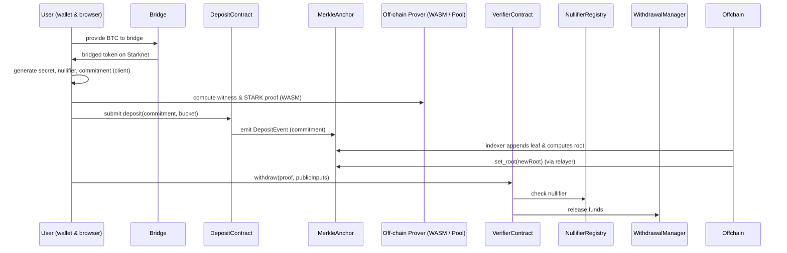

Nice — I inspected the repository and put together a drop-in, **developer-friendly README** you can paste into `README.md` (or use as a README-redraft PR). It keeps the repo’s technical depth (Cairo contracts, prover/WASM, Merkle accumulator) while adding clear diagrams, quickstart steps, and audited-safety notes.

I cite the repo page I read so maintainers can verify where I pulled the base info. ([GitHub][1])

---

# README (improved) — **Zephyr / starkbtcprivacy**

> **Zephyr — ZK-Private Bitcoin on Starknet**
> Non-custodial, STARK-proof privacy layer for bridged Bitcoin on Starknet. Shield bridged BTC into a Merkle accumulator, generate STARK ownership proofs (WASM or prover pool), and withdraw privately without linking deposits → withdrawals. ([GitHub][1])

---

## Table of contents

1. [Overview & Motivation](#overview--motivation)
2. [High-level architecture (diagrams)](#high-level-architecture-diagrams)
3. [Core cryptography & data structures](#core-cryptography--data-structures)
4. [Smart contracts (components)](#smart-contracts-components)
5. [Developer quickstart (run & test)](#developer-quickstart-run--test)
6. [Deposit → Withdraw sequence (detailed)](#deposit--withdraw-sequence-detailed)
7. [Security & safety checklist](#security--safety-checklist)
8. [Contributing / Roadmap / Contact](#contributing--roadmap--contact)

---

## 1) Overview & motivation

When BTC is bridged into L2s such as Starknet, bridge + L2 transactions are linkable via public state. Zephyr restores privacy by providing:

* **Client-side secret control** — secrets never posted on chain.
* **STARK proofs** to prove membership/ownership w/out revealing secrets.
* **Composable primitives** for wallets, DeFi, NFTs and DAO usage.

(Repository contains Cairo contracts, front-end assets and off-chain components.) ([GitHub][1])

---

## 2) High-level architecture — diagrams

Paste the following *Mermaid* diagrams directly into the repo README (GitHub renders them).

### 2.1 Component diagram

```mermaid
flowchart LR
  BTC[Bitcoin mainnet (UTXO)]
  Bridge[Bridging / Wrapped BTC on Starknet]
  subgraph Zephyr
    Deposit[DepositContract]
    Merkle[MerkleAccumulator / MerkleAnchor]
    Verifier[VerifierContract (STARK verify)]
    Null[NullifierRegistry]
    Withdrawal[WithdrawalManager]
    Fee[FeeManager]
    Gov[Governance / Timelock]
  end
  Offchain[Off-chain: WASM Prover / ProverPool / Indexer / Relayer]
  Apps[Composed Apps: Private DeFi / NFTs / DAOs]

  BTC --> Bridge --> Deposit
  Deposit --> Merkle --> Offchain
  Offchain --> Verifier
  Verifier --> Null
  Verifier --> Withdrawal
  Withdrawal --> Apps
  Gov --> Fee
  Fee --> Withdrawal
```

### 2.2 Sequence (Deposit → Withdraw)



> These diagrams map the primary on-chain contracts and off-chain components used by the project. The repo already contains example mermaid + ASCII diagrams — this README expands and clarifies them. ([GitHub][1])

---

## 3) Core cryptography & data structures

**Commitment / Nullifier (canonical forms)**

```text
secret := random_bytes(32)
nullifier := H_Poseidon(secret || salt)         // prevents double-spend
secret_hash := H_Pedersen(secret || nonce)
commitment := Poseidon(secret_hash, amount_bucket, randomness)
```

* **Commitment** binds secret + amount_bucket + randomness (circuit-friendly hashes).
* **Nullifier** is derived from secret and published only during spend to block reuse.
* **Merkle accumulator**: sparse or incremental Merkle (depth configurable; example depth = 20 → ~1M leaves).

---

## 4) Smart contracts (components & purpose)

Brief summary of core contracts in repo:

* **DepositContract** — accepts commitment events (commitment + bucket), emits `DepositEvent`.
* **MerkleAnchor** — stores on-chain root(s); root updates are done by relayer / indexer policy.
* **VerifierContract** — on-chain STARK verifier; verifies proofs & public inputs.
* **NullifierRegistry** — single-use markers; `markSpent(nullifier)` prevents double-spend.
* **WithdrawalManager** — on-chain transfer / relayer coordination to release bridged BTC.
* **Governance / Admin** — proxy + timelock + multisig for upgrades and parameter changes.

(These components and file directories are present in the repository.) ([GitHub][1])

---

## 5) Developer quickstart — local dev & tests

> **Prerequisites** (examples)

* Node.js (LTS), npm or bun (repo includes `bun.lockb` / `package.json`)
* Cairo toolchain (cairo-lang) or Protostar for Cairo development
* Starknet devnet / testnet account + wallet

### Install (JS frontend + tools)

```bash
# frontend
npm install
# or if using bun
# bun install

# install cairo toolchain separately per your OS
# pip install cairo-lang  (or follow protostar docs)
```

### Build & run (example)

```bash
# start local frontend (if scripts exist)
npm run dev

# compile cairo contracts (example)
cairo-compile contracts/*.cairo --output build/compiled.json

# run prover locally (WASM) — depends on project tooling
# run tests (Cairo unit tests)
protostar test
```

> NOTE: this repo contains `package.json` and a `cairo/` directory; update the commands to match project `scripts` (e.g. `npm run build`, `npm run start`). ([GitHub][1])

---

## 6) Deposit → Withdraw (detailed, atomicity properties)

**Withdraw pseudocode (on-chain simplified)**

```cairo
func withdraw{
  syscall_ptr: felt*, pedersen_ptr: HashBuiltin*
}(
  proof: felt*, public_inputs: PublicInputs
) -> () {
  // 1. validate root matches an anchored root
  assert(public_inputs.root == MerkleAnchor.get_root());
  // 2. verify STARK proof
  let is_valid = Verifier.verify(proof, public_inputs);
  assert(is_valid == 1);
  // 3. check nullifier not spent
  assert(!NullifierRegistry.isSpent(public_inputs.nullifier));
  // 4. mark nullifier (atomic)
  NullifierRegistry.markSpent(public_inputs.nullifier);
  // 5. release funds
  WithdrawalManager.release(public_inputs.recipient, public_inputs.amount_bucket);
}
```

**Atomicity requirement**: the verify + mark-nullifier + release funds must be effectively atomic on-chain; otherwise a race could allow double-spend. The Cairo contract pattern should ensure state changes only after successful verify, and revert otherwise.

---

## 7) Security & safety checklist

**Must-have patterns**

* `verify -> markNullifier -> release` as an atomic on-chain path.
* Root updates rate-limited and gated to relayer policy / multi-sig to avoid poisoning.
* Timelock + multisig + proxy pattern for upgrades (no admin single-key override).
* Min deposit size / bucketization to reduce Sybil & correlation attacks.
* External audits & formal verification for STARK circuits and Cairo contracts.

**Threat surfaces & mitigations**

* *Indexer / relayer metadata leaks*: use onion relayers or ephemeral relayer keys.
* *Prover pool trust*: provide attestation / HSM or prefer client-WASM prover for high privacy.
* *Admin upgrades*: require timelock and multisig; document key rotation & playbooks.

(Adapt the repo’s existing security notes and expand during audits.) ([GitHub][1])

---

## 8) Testing & gas notes

* **Merkle depth**: recommended default 20 (≈1M leaves) — tune for project needs.
* **Proof size**: STARKs can be tens–hundreds KB (WASM generation time: device dependent).
* **On-chain verify cost**: optimize circuit public inputs and verifier bytecode; batch where possible.

Add CI to run Cairo tests (`protostar` or `starknet-devnet` integration) and include gas regression tests.

---

## 9) Contributing, governance & contact

* **Contributing**: PRs welcome. Please run tests locally; include unit & integration tests for contract changes.
* **Governance**: outline timelock / multisig parameters in repo docs.
* **Contact / Support**: Open an issue or reach out to the maintainer on the repo page. ([GitHub][1])

---

## Appendix — copy-paste assets & snippets

**Mermaid blocks** (component & sequence) — already included above; drop them into README.
**Commitment formula** (mono block):

```text
secret := random_bytes(32)
nullifier := H_Poseidon(secret || salt)
secret_hash := H_Pedersen(secret || nonce)
commitment := Poseidon(secret_hash, amount_bucket, randomness)
```

**Verifier pseudocode (Cairo-style)** (included in section 6).

